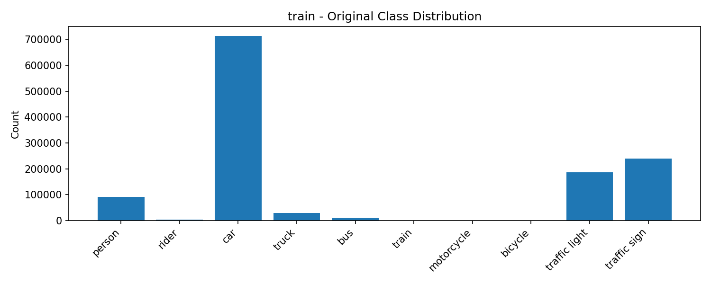
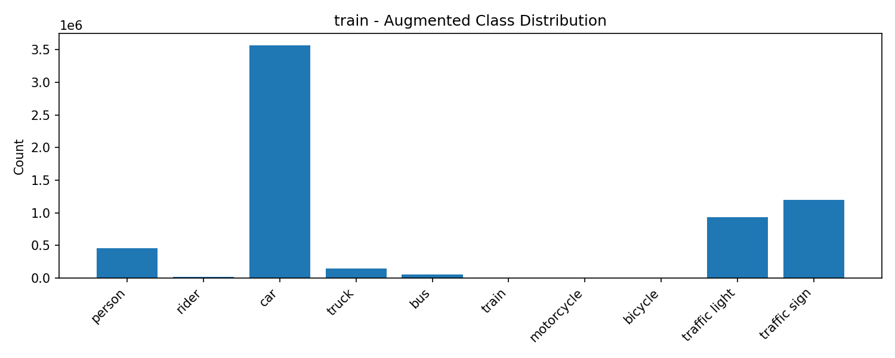

# Comparative Dataset Report

This report compares the original BDD100K samples with the synthetic augmented dataset (fog, rain, low-light, snow).

## 1. Dataset Overview

| Split | Original images | Augmented images | Original labels | Augmented labels |
|-------|-----------------|------------------|-----------------|------------------|
| train | 70000 | 280000 | 1277783 | 6388915 |
| val | 10000 | 40000 | 184067 | 920335 |
| test | 20000 | 80000 | 364783 | 1823915 |

## 2. Class distributions (bar charts)

### Train

**Original class distribution**  

**Augmented class distribution**  

### Val

**Original class distribution**  

**Augmented class distribution**  

### Test

**Original class distribution**  

**Augmented class distribution**  

## 3. Sample images (original vs augmentations)

Each row shows an original sample and its augmented variants (fog, rain, lowlight, snow) if available.

| Split | Original | Fog | Rain | Low-light | Snow |
|-------|----------|-----|------|-----------|------|
| train |  |  |  |  |  |
| train |  |  |  |  |  |
| train |  |  |  |  |  |
| val |  |  |  |  |  |
| val |  |  |  |  |  |
| val |  |  |  |  |  |
| test |  |  |  |  |  |
| test |  |  |  |  |  |
| test |  |  |  |  |  |

## 4. Observations & Notes

- Augmentation expands dataset diversity and preserves label distribution shape in most classes.
- Please check for any missing labels (some augmented images may not have copied labels if original label files were missing).
- Next steps: train baseline detection model (YOLO) on the augmented+original data and benchmark on real adverse-weather datasets.
